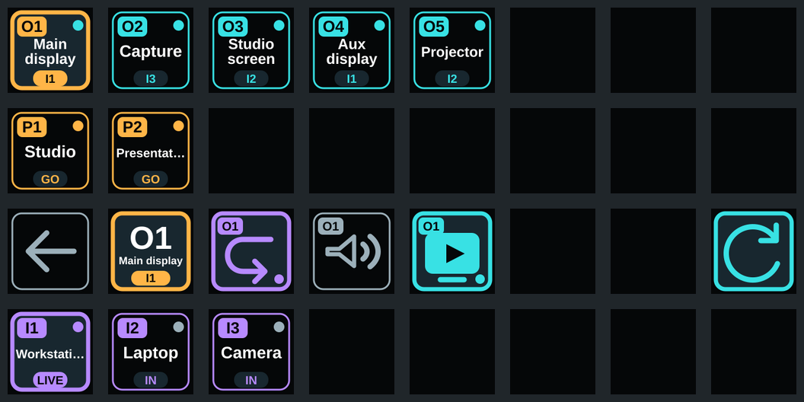

# HDMI Matrix for OpenDeck


Local Stream Deck control for an HDCVT HDMI matrix. The plugin shows only connected outputs, active inputs and renamed presets. Pick an output, then pick an input to route it.

The included profile is designed for an 8 by 4 Stream Deck XL:



```text
Outputs
Presets
Back | selected output | ARC | mute | stream | · | · | refresh
Inputs
```

## Features

- Routes any active input to the selected output
- Shows port names from the matrix
- Hides inputs without a signal and outputs without a connected display
- Recalls renamed presets while hiding untouched factory presets
- Controls ARC, audio mute and HDMI output streaming
- Uses output streaming as a practical disconnect switch
- Polls the matrix locally without a cloud service

## Compatibility

| Device | Status |
| --- | --- |
| HDCVT `HDP-MXC88A`, 8 by 8, 18 Gbps | Tested |
| Rebranded 8 by 8 matrices with the same HDCVT web firmware | May work, not tested |
| Other HDMI matrices | Not supported unless they implement the same HTTP API |

Development and daily use were tested with matrix firmware `V1.00.19`, web firmware `V2.00.22` and OpenDeck `2.14.0`.

The model name alone is not enough for an untested device. This plugin expects `POST /cgi-bin/instr` and these JSON commands:

- `get input status`
- `get output status`
- `get video status`
- `video switch`
- `preset set`
- `set arc`
- `set output audio mute`
- `tx stream`

You can check the model and firmware without changing anything:

```bash
curl -s http://MATRIX-IP/cgi-bin/instr \
  -H 'Content-Type: application/json' \
  -d '{"comhead":"get status","language":0}'
```

A known compatible response contains `"model":"HDP-MXC88A"`. If another model returns the same status shapes and commands, open an issue with its model and firmware so it can be added to the compatibility table.

The bundled profile assumes 32 keys. Smaller decks and 4 by 4 matrices have not been tested.

## Installation

Requirements:

- OpenDeck with the bundled Starter Pack plugin
- Node.js 20 or newer for the one-time profile setup
- The matrix and computer on the same local network

1. Download `de.beasty.hdmi-matrix.streamDeckPlugin` from the [latest GitHub release](https://github.com/beastyrabbit/opendeck-hdmi-matrix/releases/latest).
2. Install it from OpenDeck's plugin manager.
3. Quit OpenDeck completely.
4. Run the setup command for your platform.

Linux:

```bash
node ~/.config/opendeck/plugins/de.beasty.hdmi-matrix.sdPlugin/setup-opendeck.mjs
```

macOS:

```bash
node "$HOME/Library/Application Support/opendeck/plugins/de.beasty.hdmi-matrix.sdPlugin/setup-opendeck.mjs"
```

Windows PowerShell:

```powershell
node "$env:APPDATA\opendeck\plugins\de.beasty.hdmi-matrix.sdPlugin\setup-opendeck.mjs"
```

5. Start OpenDeck. The setup creates the `HDMI Matrix` profile and adds a launcher to the first free key in `Default`.
6. In OpenDeck, open the `HDMI Matrix` profile and select any Matrix key. Enter the address of the web interface under `Matrix URL` in the settings panel, then press `Save connection`.

OpenDeck stores the address as a global plugin setting. Every Matrix key uses it, so you only set it once. The build and setup scripts never contain or write the address.

For a Flatpak installation, pass its configuration directory explicitly:

```bash
node ~/.var/app/me.amankhanna.opendeck/config/opendeck/plugins/de.beasty.hdmi-matrix.sdPlugin/setup-opendeck.mjs \
  --config ~/.var/app/me.amankhanna.opendeck/config/opendeck
```

Custom profile names are supported:

```bash
node setup-opendeck.mjs \
  --matrix-profile "Matrix" \
  --return-profile "My main profile"
```

Quit OpenDeck before running the setup. On Linux, the script refuses to edit profiles while OpenDeck is running. It also backs up an existing profile before replacing an incompatible Matrix layout.

## Use

Press the launcher in the main profile. In the Matrix profile, select an output in the top row and an input in the bottom row. The route changes immediately.

ARC, mute and stream always control the amber selected output. Turning stream off disables that HDMI output while retaining its last input mapping. Turning it on restores the output with the same mapping.

## How it works

The setup script writes a 32-key OpenDeck profile and places a native profile-switch button in the main profile. The launcher and back buttons use OpenDeck's Starter Pack. The remaining keys belong to this plugin.

When the Matrix profile becomes visible, the plugin reads three status records from `POST /cgi-bin/instr`: inputs, outputs and video routing. It uses those records to draw every key. Disconnected outputs, inputs without a signal and factory-named presets render as blank keys. The plugin repeats the status read every four seconds and after each button press.

Output selection is local to each Stream Deck. Pressing an active output marks it amber without changing a route. Pressing an input then sends `video switch` with the selected output and input port. Presets send `preset set`. ARC, mute and stream read the current value first and send the inverse value for the selected output.

The Matrix URL comes only from OpenDeck's global plugin settings. The property inspector saves it through the OpenAction `setGlobalSettings` event. The plugin receives the setting, creates the local HTTP client and refreshes the visible keys. No cloud service or external server takes part.

The matrix accepts one command at a time, so the plugin serializes all HTTP requests. A request times out after three seconds. Invalid JSON is retried twice because this firmware occasionally returns an incomplete response.

## Build from source

```bash
pnpm install
pnpm verify
```

The build writes the plugin bundle, setup script and installable package to `dist/`. Tests use a local HTTP mock and never change a real matrix route.

### Local deployment on Linux

During development, this command handles the complete local update:

```bash
pnpm deploy:opendeck
```

It builds the plugin, stops a running OpenDeck process, installs the new build, updates the Matrix profile and starts OpenDeck again with its previous command-line arguments. OpenDeck keeps the Matrix URL in its global plugin settings, outside the plugin directory, so local deployments do not overwrite it. If OpenDeck was already stopped, the command leaves it stopped.

Pass profile setup options after `--`:

```bash
pnpm deploy:opendeck -- --matrix-profile "Matrix" --return-profile "Studio"
```

Preview the operation without stopping or changing OpenDeck:

```bash
pnpm deploy:opendeck -- --dry-run
```

The dry run still refreshes the local `dist/` build. Automatic process restart is Linux-only. On macOS and Windows, use `pnpm build`, quit OpenDeck and run the bundled setup script manually.

## OpenAction Marketplace

The OpenDeck plugin store reads the [OpenAction plugin registry](https://github.com/OpenActionAPI/plugins). A marketplace submission needs:

1. A public GitHub repository with the `openaction` topic
2. A GitHub release containing one `.streamDeckPlugin` asset
3. An entry for `de.beasty.hdmi-matrix` in the registry's `catalogue.json`
4. A matching high-resolution icon named `de.beasty.hdmi-matrix.png`
5. A pull request to the registry repository

The catalogue `name` and `author` must exactly match `plugin/manifest.json`. OpenDeck then finds the newest non-prerelease GitHub release and installs its `.streamDeckPlugin` asset.

## License

[MIT](LICENSE). This project is not affiliated with HDCVT, OpenDeck or Elgato.
